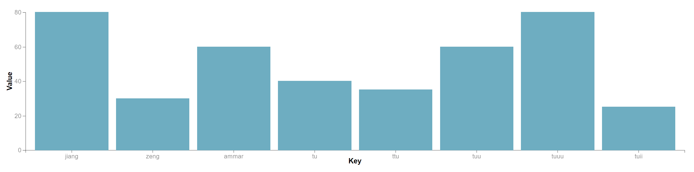
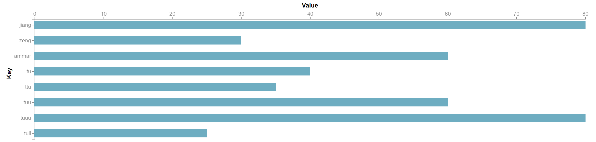
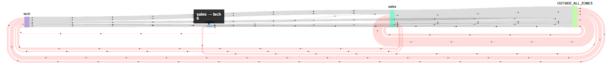
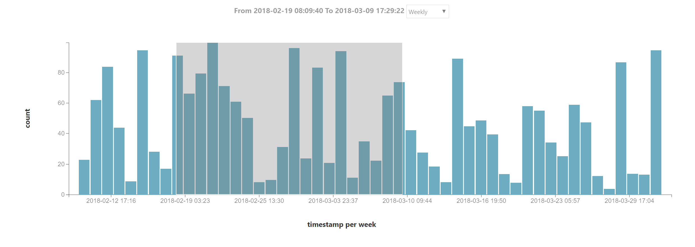
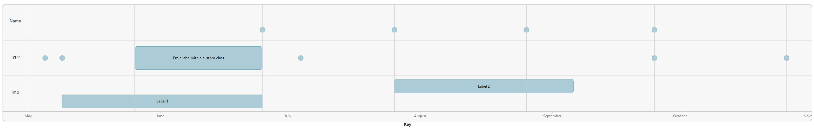

# Vs
Vue Visualisation Package with d3.


## Installation
```javascript
npm i -S GopherJ/Vs
```


## Lists

- `d3SankeyCircular`
- `d3Bar`
- `d3Line`
- `d3Pie`
- `d3Timelion`
- `d3ProgressArc`
- `d3Timeline`


## Usage

`main.js`
```
import Vs from 'Vs';

Vue.use(Vs);
```

`template`
```vue
// I write options, margin, height and width just to show the value by default
// If you don't need to change it, just omit it simply add data

// pie or dongnut
<d3-pie :data="data" :options="{
    // pie size config
    innerRadius : 5,
    cornerRadius : 5,

    // gap between arcs config
    padAngle : 0.01,

    // tooltip config
    arcTitle : d => d.data.value,

    // arc label
    arcLabel : d => d.data.key,

    // axisX label config
    axisXLabelHeight : 30,
    axisXLabel : 'Key',
    axisXLabelFontSize : 12,
    axisXLabelFontWeight : 400,
    axisXLabelFontOpacity : 0.5,

    // arc label config
    arcLabelFontSize : 10,
    arcLabelFontOpacity : 0.5,

    // animation config
    animationDuration : 1000
}" width="100%" height="400px" :margin="{
    left: 0,
    top: 0,
    right: 0,
    bottom: 0
}"></d3-pie>

// line
<d3-line :data="data" :options="{
    // line config
    stroke : 'rgb(188, 82, 188)',
    strokeWidth : 2,

    // axis config
    axisXHeight : 25,
    axisYWidth : 35,
    axisFontSize : 14,

    // circle config
    circleRadius : 5,
    circleColor : 'rgb(188, 82, 188)',

    // tooltip config
    circleTitle : d  => d.value,

    // curve config
    curve : 'curveCardinal',

    // axis label config
    axisXLabel : 'Key',
    axisYLabel : 'Value',
    axisXLabelHeight : 30,
    axisYLabelWidth : 20,
    axisLabelFontSize : 12,
    axisLabelFontWeight : 400,
    axisLabelFontOpacity : 0.5
}" width="100%" height="400px" :margin="{
    left: 0,
    top: 20,
    right: 10,
    bottom: 0
}"></d3-line>

// horizontal bar
<d3-bar :data="data" :options="{
    // bar config
    fill : '#6eadc1',
    stroke : '#6eadc1',
    fillOpacity : 0.6,
    strokeOpacity : 1,
    barTitle : d => d.value,

    // axis font config
    axisFontSize : 12,
    axisFontWeight : 400,

    // axis label config
    axisYLabel : 'Value',
    axisXLabel : 'Key',
    axisXLabelHeight : 20,
    axisYLabelWidth : 20,

    // axis label font config
    axisLabelFontSize : 12,
    axisLabelFontWeight : 400,
    axisLabelFontOpacity : 0.5,

    // axis lane config
    axisXHeight : 25,
    axisYWidth : 35,

    isVertical : false,
}" width="100%" height="400px" :margin="{
    left: 0,
    top: 20,
    right: 0,
    bottom: 0
}"></d3-bar>

// vertical bar
<d3-bar :data="data" :options="{
    // bar config
    fill : '#6eadc1',
    stroke : '#6eadc1',
    fillOpacity : 0.6,
    strokeOpacity : 1,
    barTitle : d => d.value,

    // axis font config
    axisFontSize : 12,
    axisFontWeight : 400,

    // axis label config
    axisYLabel : 'Value',
    axisXLabel : 'Key',
    axisXLabelHeight : 20,
    axisYLabelWidth : 20,

    // axis label font config
    axisLabelFontSize : 12,
    axisLabelFontWeight : 400,
    axisLabelFontOpacity : 0.5,

    // axis lane config
    axisXHeight : 25,
    axisYWidth : 35,

    isVertical : true,
}" width="100%" height="400px" :margin="{
    left: 30,
    top: 0,
    right: 0,
    bottom: 0
}"></d3-bar>

// sankey
<d3-sankey-circular :nodes="nodes" :links="links" :options="{
    nodeWidth : 20,
    nodeText : 'font-size: .8rem; font-weight: 600; font-family: sans-serif;',
    circularLinkGap : 4,
    circularLinkColor : 'red',
    linkColor : 'black',
    arrowLength : 10,
    gapLength : 150,
    arrowHeadSize : 4
}" width="100%" height="400px" :nodeTitle="d => `${d.name}<br>${d.value}`" :linkTitle="d => `${d.source.name} → ${d.target.name}<br>${d.value}`"></d3-sankey-circular>

// timelion, need to use with other wrapper
<d3-timelion :data="data" :options="{
    // bar config
    fill : '#6eadc1',
    stroke : '#6eadc1',
    fillOpacity : 0.6,
    strokeOpacity : 1,

    // axis config
    axisXHeight : 25,
    axisYWidth : 35,

    // axis label config
    axisXLabel : 'Key',
    axisYLabel : 'Value',
    axisFontSize : 12,
    axisLabelOpacity : 0.5,
    axisLabelFontWeight : 600,
    axisXLabelHeight : 60,
    axisYLabelWidth : 60,

    // time label config
    timeRangeLabelHeight : 40,
    timeRangeLabelFontSize : 12,
    timeRangeLabelOpacity : 0.5,
    timeRangeLabelFontWeight : 400,

    // tooltip config
    barTitle : d => `${new Date(d.key)}<br>${d.value}`
}" width="100%" height="400px" :margin="{
    left: 0,
    top: 0,
    right: 20,
    bottom: 0
}" @range-updated="(dateTimeStart, dateTimeEnd, interval) => fetchDataWithCurrentInterval(dateTimeStart, dateTimeEnd, interval)"
   @interval-updated="interval => fetchDataWithInterval(interval)">
</d3-timelion>


// ProgressArc
<d3-progress-arc :data="[{
  angle: Math.PI * 2,
  text: 'key1',
}, {
  angle: Math.PI * 2 * 23/24,
  text: 'key2',
}, {
  angle: Math.PI * 2 * 23/24 * 23/24,
  text: 'key3'
}, {
  angle: Math.PI * 2 * 23/24 * 23/24 * 23/24,
  text: 'key4'
}, {
  angle: Math.PI * 2 * 23/24 * 23/24 * 23/24 * 23/24,
  text: 'key5'
}, {
  angle: Math.PI * 2 * 23/24 * 23/24 * 23/24 * 23/24 * 23/24,
  text: 'key6'
}].reverse()" width="100%" height="400px" :options="{
  innerRadius : 40,
  cornerRadius : 8,
  circleRadius : 4,
  textMarginLeft : 2,
  textFontSize : 16,
  animationDuration : 2000,
  animationDelay : 50
}"></d3-progress-arc>
```


## Examples

```vue
<template>
  <div class="hello">
    <d3-bar :data="data"></d3-bar>
    <d3-pie :data="data"></d3-pie>
    <d3-line :data="data"></d3-line>
    <d3-bar :data="data" :options="{isVertical: true}"></d3-bar>
    <d3-sankey-circular v-bind="dataSankey"></d3-sankey-circular>
    <d3-time-line :data="dataTimeline"></d3-time-line>
    <d3-time-lion :data="dataTimelion"></d3-time-lion>
  </div>
</template>

<script>
export default {
    data: () => {
        return {
            dataSankey: {"links":[{"source":"sales","target":"OUTSIDE_ALL_ZONES","userid":"67ea8ec6c040a5af","value":33},{"source":"OUTSIDE_ALL_ZONES","target":"sales","userid":"67ea8ec6c040a5af","value":28},{"source":"tech","target":"sales","userid":"231bed80cb5b7ce3","value":6},{"source":"sales","target":"OUTSIDE_ALL_ZONES","userid":"231bed80cb5b7ce3","value":9},{"source":"tech","target":"OUTSIDE_ALL_ZONES","userid":"67ea8ec6c040a5af","value":7},{"source":"sales","target":"tech","userid":"67ea8ec6c040a5af","value":4},{"source":"tech","target":"sales","userid":"67ea8ec6c040a5af","value":7},{"source":"OUTSIDE_ALL_ZONES","target":"tech","userid":"67ea8ec6c040a5af","value":6},{"source":"tech","target":"OUTSIDE_ALL_ZONES","userid":"231bed80cb5b7ce3","value":9},{"source":"sales","target":"tech","userid":"231bed80cb5b7ce3","value":6},{"source":"OUTSIDE_ALL_ZONES","target":"sales","userid":"231bed80cb5b7ce3","value":8},{"source":"OUTSIDE_ALL_ZONES","target":"tech","userid":"231bed80cb5b7ce3","value":12},{"source":"tech","target":"coffee","userid":"231bed80cb5b7ce3","value":2},{"source":"coffee","target":"OUTSIDE_ALL_ZONES","userid":"231bed80cb5b7ce3","value":4},{"source":"sales","target":"OUTSIDE_ALL_ZONES","userid":"a826a473bfd66921","value":0},{"source":"OUTSIDE_ALL_ZONES","target":"coffee","userid":"231bed80cb5b7ce3","value":5},{"source":"coffee","target":"sales","userid":"231bed80cb5b7ce3","value":1},{"source":"coffee","target":"tech","userid":"231bed80cb5b7ce3","value":1}],"nodes":[{"name":"OUTSIDE_ALL_ZONES"},{"name":"sales"},{"name":"tech"},{"name":"coffee"}]},
            dataTimelion: [{"key":1492256104916,"value":24.92506528632471},{"key":1460720104916,"value":45.530455717461535},{"key":1429184104916,"value":24.99696518622455},{"key":1397648104916,"value":33.742346701920525},{"key":1366112104916,"value":50.885476964208124},{"key":1334576104916,"value":97.5477088909558},{"key":1303040104916,"value":33.382291611728334},{"key":1271504104916,"value":28.366296062876128},{"key":1239968104916,"value":29.342472731189762},{"key":1208432104916,"value":90.33312702499624},{"key":1176896104916,"value":59.940402493671584},{"key":1145360104916,"value":45.44284972156446},{"key":1113824104916,"value":39.22211220343625},{"key":1082288104916,"value":47.350360469506526},{"key":1050752104916,"value":82.17506150769812},{"key":1019216104916,"value":73.23478668070958},{"key":987680104916,"value":19.430658222096064},{"key":956144104916,"value":66.5497153800747},{"key":924608104916,"value":72.71574718462011},{"key":893072104916,"value":82.14376060333201},{"key":861536104916,"value":12.03999575121194},{"key":830000104916,"value":37.563018451724936},{"key":798464104916,"value":21.430084941162054},{"key":766928104916,"value":96.87931404425588},{"key":735392104916,"value":92.24499458760346},{"key":703856104916,"value":33.989890530846075},{"key":672320104916,"value":41.56191574651663},{"key":640784104916,"value":88.42507863314431},{"key":609248104916,"value":79.7337714588073},{"key":577712104916,"value":15.426651488665089},{"key":546176104916,"value":82.00658694240691},{"key":514640104916,"value":47.877006396984555},{"key":483104104916,"value":58.51417858515661},{"key":451568104916,"value":70.97849962601813},{"key":420032104916,"value":18.84709979159307},{"key":388496104916,"value":62.99109655054198},{"key":356960104916,"value":86.27531759375223},{"key":325424104916,"value":85.21505798341676},{"key":293888104916,"value":53.188691415121525},{"key":262352104916,"value":82.0492047136508},{"key":230816104916,"value":47.41213464562015},{"key":199280104916,"value":48.69480413928136},{"key":167744104916,"value":86.51890707255095},{"key":136208104916,"value":10.94680833660594},{"key":104672104916,"value":27.721588734413636},{"key":73136104916,"value":76.3437011339861},{"key":41600104916,"value":57.72031276286144},{"key":10064104916,"value":61.614975108268425},{"key":-21471895084,"value":77.51061440096413},{"key":-53007895084,"value":92.47637856894694}],
            dataTimeline: [{ group: 'Name', at: new Date([2016, 5, 1]).valueOf(), title: 'kjlqwjq' }, { group: 'Name', at: new Date([2016, 5, 1]).valueOf(), title: 'wlqjlw' }, { group: 'Name', at: new Date([2016, 7, 1]).valueOf(), title: 'lqwpqow' }, { group: 'Name', at: new Date([2016, 8, 1]).valueOf(), title: 'wopqowp' }, { group: 'Name', at: new Date([2016, 9, 1]).valueOf(), title: 'qoiwiu' }, { group: 'Name', at: new Date([2016, 10, 1]).valueOf(), title: 'poiwsklajs' }, { group: 'Type', at: new Date([2016, 5, 11]).valueOf(), title: 'owqpwpqw' }, { group: 'Type', at: new Date([2016, 5, 15]).valueOf(), title: 'qpwiqiwpo' }, { group: 'Type', at: new Date([2016, 7, 10]).valueOf(), title: 'wqpwipqw' }, { group: 'Type', label: 'I\'m a label with a custom class', from: new Date([2016, 6, 1]).valueOf(), to: new Date([2016, 7, 1]).valueOf(), }, { group: 'Type', at: new Date([2016, 10, 1]).valueOf(), title: 'wqwqwipqw' }, { group: 'Type', at: new Date([2016, 11, 1]).valueOf(), title: 'wqsjksals' }, { group: 'Imp', label: 'Label 1', from: new Date([2016, 5, 15]).valueOf(), to: new Date([2016, 7, 1]).valueOf() }, { group: 'Imp', label: 'Label 2', from: new Date([2016, 8, 1]).valueOf(), to: new Date([2016, 9, 12]).valueOf() } ],
            nodes: [
             { name: 'a' },
             { name: 'b' }
            ],
            links: [{
                source: 'a',
                target: 'b',
                value: 10
            }],
            data: [
              {key: 'jiang', value: 80},
              {key: 'zeng', value: 30},
              {key: 'ammar', value: 60},
              {key: 'tu', value: 40},
              {key: 'ttu', value: 35},
              {key: 'tuu', value: 60},
              {key: 'tuuu', value: 80},
              {key: 'tuii', value: 25},
            ]
        }
    }
}
</script>
```














