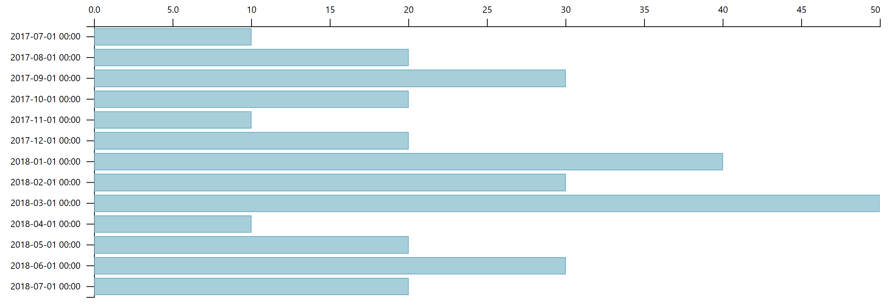
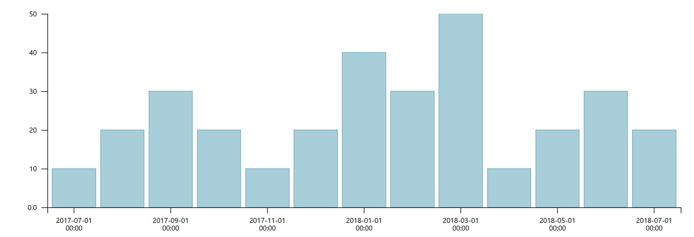
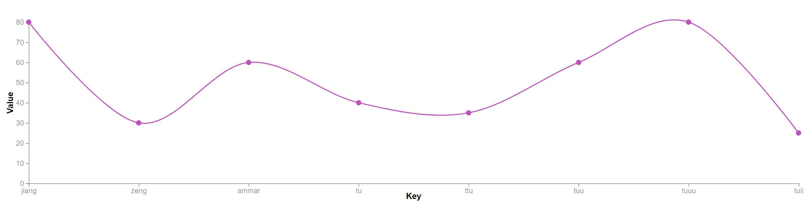
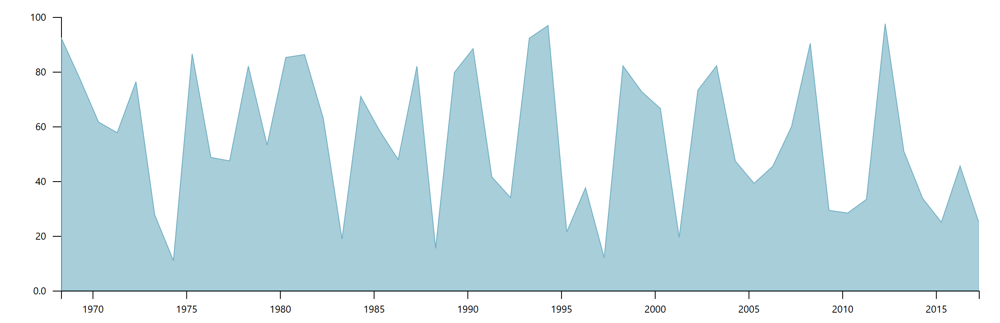
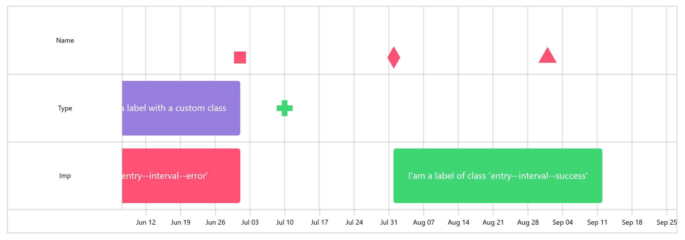
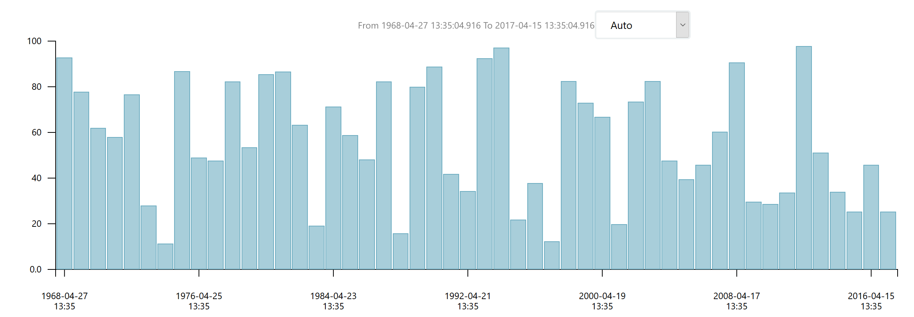
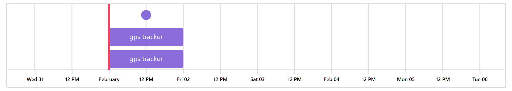
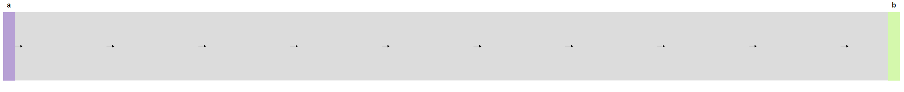
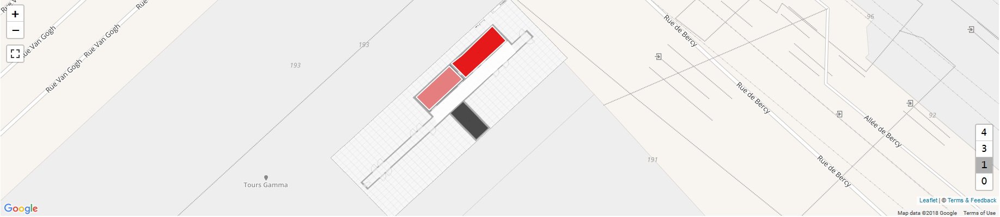
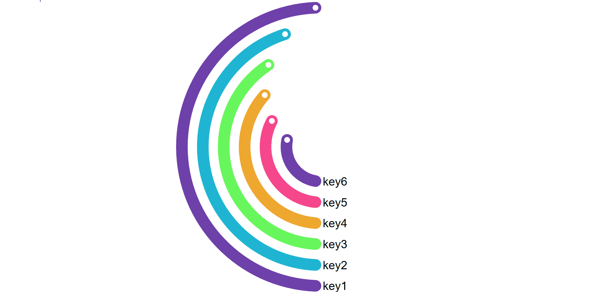

# Vs
Vue Visualisation Package With `d3.js`. Trusted by [Ubudu](http://www.ubudu.com).


# Project

- [traject](http://traject.ubudu.com)


## Installation
```javascript
npm i -S d3-vs
```


## Demo
[Vs](https://gopherj.github.io/Vs/#/)


## Lists

### Basic

- `d3HorizontalBar`
- `d3VerticalBar`
- `d3Area`
- `d3Line`
- `d3Pie`

### Time Serie

- `d3HorizontalBar`
- `d3VerticalBar`
- `d3Area`
- `d3Line`
- `d3Timelion`
- `d3Timeline`
- `d3Tracker`

### Functional

- `d3ProgressArc`
- `d3Slider`
- `d3Tracker`

### Layout

- `d3ICicleHorizontal`
- `d3ICicleVertical`
- `d3Tree`
- `d3Cluster`
- `d3Sunburst`
- `d3Pack`

### Metric

- `d3Metric`
- `d3Circle`

### Grouped

- `d3MultiLine`

### Flow

- `d3SankeyCircular`

### Leaflet

- `d3LChoropleth`
- `d3LHeat`


## Usage

`main.js`
```javascript
import Vs from 'd3-vs';

Vue.use(Vs);
```

`template`
```vue
<d3-pie
    :data="data"
    :options="options"
    :margin="margin"
    width="100%"
    height="400px">
</d3-pie>

<d3-line
    :data="data"
    :options="options"
    :margin="margin"
    width="100%"
    height="400px">
</d3-line>

<d3-horizontal-bar
    :data="data"
    :options=""options
    :margin="margin"
    width="100%"
    height="400px">
</d3-horizontal-bar>

<d3-vertical-bar
    :data="data"
    :options="options"
    :margin="margin"
    width="100%"
    height="400px">
</d3-vertical-bar>

<d3-area
    :data="data"
    :options="options"
    :margin="margin"
    width="100%"
    height="400px">
</d3-area>

<d3-sankey-circular
    :nodes="nodes"
    :links="links"
    :options="options"
    :nodeTitle="nodeTitle"
    :linkTitle="linkTitle"
    width="100%"
    height="400px">
</d3-sankey-circular>

<d3-multi-line
    :data="data"
    :options="options"
    :margin="margin"
    width="100%"
    height="400px">
</d3-multi-line>

<d3-timelion
    :data="data"
    :options="options"
    :margin="margin"
    width="100%"
    height="400px"
    @range-updated="(dateTimeStart, dateTimeEnd, interval) => fetchDataWithCurrentInterval(dateTimeStart, dateTimeEnd, interval)"
    @interval-updated="interval => fetchDataWithInterval(interval)">
</d3-timelion>

<d3-timeline
    :data="data"
    :options="options"
    :margin="margin"
    width="100%"
    height="400px">
</d3-timeline>

<d3-progress-arc
    :data="data"
    :options="options"
    :margin="margin"
    width="100%"
    height="400px">
</d3-progress-arc>

<d3-tracker
    :data="data"
    :options="options"
    :margin="margin"
    width="100%"
    height="400px"
    @reference-updated="(dateTimeRange, entries) => yourMethod(dateTimeRange, entries)">
</d3-tracker>

<d3-slider
    v-model="data"
    :min="min"
    :max="max"
    :margin="margin"
    :options="options"
    width="100%"
    height="100%">
</d3-slider>

<d3-icicle-horizontal
    :data="data"
    :options="options"
    :margin="margin"
    width="100%"
    height="400px">
</d3-icicle-horizontal>

<d3-icicle-vertical
    :data="data"
    :options="options"
    :margin="margin"
    width="100%"
    height="400px">
</d3-icicle-vertical>

<d3-tree
    :data="data"
    :options="options"
    :margin="margin"
    width="100%"
    height="400px">
</d3-tree>

<d3-cluster
    :data="data"
    :options="options"
    :margin="margin"
    width="100%"
    height="400px">
</d3-cluster>

<d3-sunburst
    :data="data"
    :options="options"
    :margin="margin"
    width="100%"
    height="400px">
</d3-sunburst>

<d3-pack
    :data="data"
    :options="options"
    :margin="margin"
    width="100%"
    height="400px">
</d3-pack>

<d3-metric
    :data="data"
    :options="options"
    :margin="margin"
    width="100%"
    height="400px">
</d3-metric>

<d3-circle
    :data="data"
    :options="options"
    :margin="margin"
    width="100%"
    height="400px">
</d3-circle>

<d3-l-choropleth
    :data="data"
    :options="options"
    :indoorMaps="indoorMaps"
    width="100%"
    height="400px">
</d3-l-choropleth>

<d3-l-heat
    :data="data"
    :options="options"
    :indoorMaps="indoorMaps"
    width="100%"
    height="400px">
</d3-l-heat>
```


## Screenshots


























## ToDo

- `d3ColorPicker`
- `d3Gantt`
- `d3Gauge`
- `d3Goal`
- `d3HeatMap`
- `d3RadialBar`
- `d3RadialSector`
- `d3RadialLine`
- `d3ScatterPlot`
- `d3Table`
- `d3WordCloud`
- `d3Markdown`
- `d3JsonViewer`
- `d3LReplay`


## License
MIT

