# Vs

Vue Visualisation Package using `d3.js` and `leaflet`. Package used in [Ubudu](http://www.ubudu.com). See also:

- [LayoutGrid](https://github.com/GopherJ/LayoutGrid)  :  Creating a powerful dashboard using `Vs` and `vue-grid-layout`


## Installation

```javascript
npm i -S d3-vs
```


## Usage

```javascript
import Vs from 'd3-vs';

// install globally all components
Vue.use(Vs);

// import only the components that you need and register it manually
import {
    // Flow Of transition
    d3SankeyCircular,

    // Time Serie
    d3Timelion,
    d3Timeline,

    // Basic
    d3Pie,
    d3Line,
    d3Metric,
    d3MultiLine,
    d3HorizontalBar,
    d3VerticalBar,
    d3GroupedArea,
    d3Area,
    d3Circle,

    // Functional
    d3Player,
    d3HorizontalSlider,
    d3VerticalSlider,

    // Layout
    d3Sunburst,
    d3Tree,
    d3Pack,
    d3Cluster,
    d3ICicleVertical,
    d3ICicleHorizontal,

    // Leaflet
    d3LChoropleth,
    d3LHeat
} from 'd3-vs';
```


## Basic


*###d3Metric*

This component is for showing simple scientific data. It accepts the type `Number` as data.

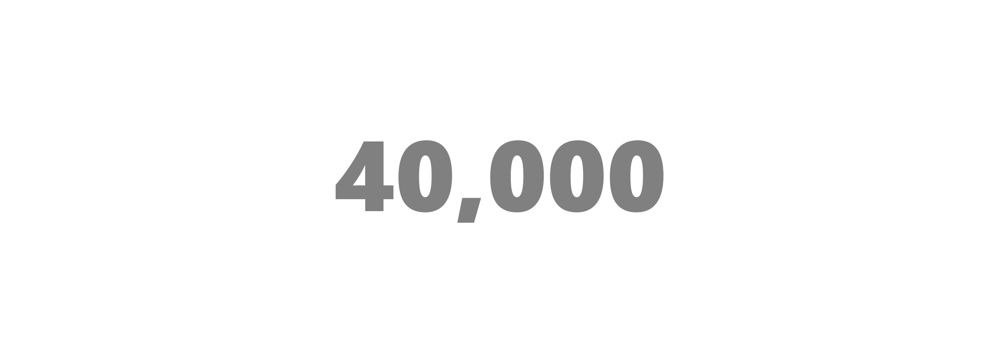

`template`

```vue
<d3-metric
    :data="data"
    :options="options"
    :margin="margin"
    width="100%"
    height="300px">
</d3-metric>
```

`options`

|key|description|type|default|
|:---|:---|:---|:---|
|`axisXLabel`|`horizontal label which will be put above the data`|`string OR null`|`null`|
|`axisLabelFontSize`|`label font size`|`number`|`12`|
|`axisLabelFontWeight`|`label font weight`|`number`|`400`|
|`axisLabelFontOpacity`|`label font opacity`|`number ([0, 1])`|`0.5`|
|`metricLabelColor`|`metric color`|`string (rgb, hex, rgba, hsl...)`|`#000000`|
|`metricLabelFontSize`|`metric font size`|`number`|`120`|
|`metricLabelFontWeight`|`metric font weight`|`number`|`900`|
|`metricLabelFontOpacity`|`metric font opacity`|`number ([0, 1])`|`0.5`|
|`metricTitle`|`metric tooltip`|`function`|`d => d`|
|`metricPrecision`|`metric precision`|`number`|`2`|


*###d3Circle*

This component is for showing simple percentage data. It accepts the type `Number` as data. The data must be in the range `[0, 1]`.


`template`

```vue
<d3-circle
    :data="data"
    :options="options"
    :margin="margin"
    width="100%"
    height="300px">
</d3-circle>
```

`options`

|key|description|type|default|
|:---|:---|:---|:---|
|`innerRadiusRatio`|`innerRadius / outerRadius`|`number`|`0.8`|
|`circleBackground`|`circle background color`|`string (rgb, hex, rgba, hsl...)`|`rgb(230, 237, 244)`|
|`circleForeground`|`circle foreground color`|`string (rgb, hex, rgba, hsl...)`|`rgb(0, 181, 241)`|
|`labelColor`|`label color`|`string (rgb, hex, rgba, hsl...)`|`rgb(0, 181, 241)`|
|`labelFontSize`|`label font size`|`number`|`50`|
|`labelFontWeight`|`label font weight`|`number`|`900`|
|`labelFontOpacity`|`label font opacity`|`number`|`0.5`|
|`precision`|`precision of data`|`number`|`2`|
|`animationDuration`|`duration of animation`|`number`|`1000`|
|`delay`|`delay of animation (milliseconds)`|`number`|`50`|


*###d3Pie*

This component can be a pie chart or a donut chart. It takes an array of elements like `{key : 'String|Date|Number', value : 'Number'}`. `key` will be used
in tooltip, `value` will be used to calculate the angle needed.


`template`

```vue
<d3-pie
    :data="data"
    :options="options"
    :margin="margin"
    width="100%"
    height="300px">
</d3-pie>
```
`options`

|key|description|type|default|
|:---|:---|:---|:---|
|`innerRadius`|`inner radius`|`number`|`50`|
|`cornerRadius`|`corner radius`|`number`|`0`|
|`padAngle`|`pad angle (percentage)`|`number`|`0.01`|
|`arcTitle`|`tooltip`|`function`|`d => d.data.key + '<br>' + d.data.value`|
|`arcLabel`|`label will be shown in arcs`|`string OR null`|`null`|
|`axisXLabel`|`label of axis x`|`string OR null`|`null`|
|`axisLabelFontSize`|`label font size`|`number`|`14`|
|`axisLabelFontWeight`|` abel font weight`|`number`|`600`|
|`axisLabelFontOpacity`|`label font opacity`|`number ([0, 1])`|`1`|
|`arcLabelFontSize`|`label font size of arcs`|`number`|`9`|
|`arcLabelFontWeight`|` abel font weight of arcs`|`number`|`400`|
|`arcLabelFontOpacity`|`label font opacity of arcs`|`number ([0, 1])`|`0.5`|
|`animationDuration`|`duration of animation`|`number`|`1000`|
|`defaultColor`|`color will be used when there is only one item in array`|`string (rgb, hex, rgba, hsl...)`|`rgb(175, 240, 91)`|


*###d3VerticalBar*

This component is for showing scientific data in vertical bar chart. It takes an array of elements like `{key : 'String|Date|Number', value : 'Number'}`, `key` will be
used in tooltip, value will be used to calculate the height needed. By default when every `key` is of type `Date` or `Number`, brush will be enabled. You can choose a new range
by using the brush or by clicking a bar if `options.axisXInterval` has been settled.

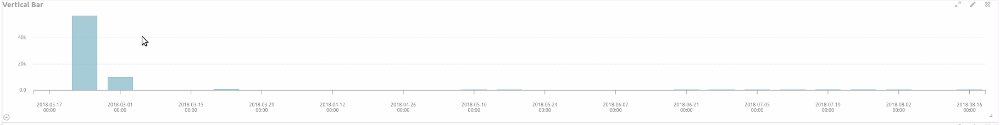


`template`

```vue
<d3-vertical-bar
    :data="data"
    :options="options"
    :margin="margin"
    width="100%"
    @range-updated="(dateTimeStart, dateTimeEnd) => fetchDataWithCurrentInterval(dateTimeStart, dateTimeEnd)"
    height="300px">
</d3-vertical-bar>
```

`options`

|key|description|type|default|
|:---|:---|:---|:---|
|`fill`|`bar internal color`|`string (rgb, hex, hsl...)`|`#6eadc1`|
|`stroke`|`bar edge color`|`string (rgb, hex, hsl...)`|`#6eadc1`|
|`fillOpacity`|`bar internal color opacity`|`number`|`0.6`|
|`strokeOpacity`|`bar edge color opacity`|`number`|`1`|
|`barTitle`|`tooltip`|`function`|`d => d.value`|
|`tickSize`|`tick height/width of axis`|`number`|`10`|
|`tickPadding`|`tick padding`|`number`|`8`|
|`axisFontSize`|`axis text font size`|`number`|`12`|
|`axisFontWeight`|`axis text font weight`|`number`|`400`|
|`axisFontOpacity`|`axis text font opacity`|`number ([0, 1])`|`0.5`|
|`axisXLabel`|`label of axis x`|`string or null`|`null`|
|`axisYLabel`|`label of axis y`|`string or null`|`null`|
|`axisLabelFontSize`|`label font size`|`number`|`14`|
|`axisLabelFontWeight`|`label font weight`|`number`|`600`|
|`axisLabelFontOpacity`|`label font opacity`|`number`|`1`|
|`axisXLaneHeight`|`lane height of axis x`|`number`|`60`|
|`axisYLaneWidth`|`lane width of axis y`|`number`|`35`|
|`axisXInterval`|`used when data is of type date_histogram, it will be used to calculate the date format of axis x. (unit: ms)`|`number OR null`|`null`|
|`isAxisPathShow`|`if the axis path will be shown`|`boolean`|`true`|
|`isAxisTickShow`|`if the axis tick will be shown`|`boolean`|`true`|
|`animationDuration`|`duration of animation`|`number`|`1000`|
|`delay`|`delay of animation (milliseconds)`|`number`|`50`|
|`axisYTickFormat`|`d3-format support`|`string`|`.2s`|
|`negative`|`the axis y should start at 0 or not`|`boolean`|`false`|
|`nice`|`the tick number of axis should be rounded or not`|`boolean`|`false`|
|`yAxisRuler`|`if the ruler of the axis y should be enabled`|`boolean`|`true`|


`events`

|name|description|arguments|
|:---|:---|:---|
|`range-updated`|`new range has been chosen by using the brush or by clicking a bar`|`(dateTimeStart, dateTimeEnd)`|


*###d3HorizontalBar*

This component is for showing scientific data in horizontal bar chart. It takes an array of elements like `{key : 'String|Date|Number', value : 'Number'}`, `key` will be
used in tooltip, value will be used to calculate the width needed. By default when every `key` is of type `Date` or `Number`, brush will be enabled. You can chose a new range
by using the brush or by clicking a bar if `options.axisYInterval` has been settled.

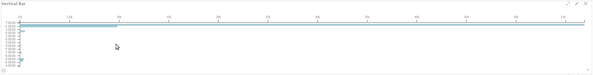

`template`

```vue
<d3-horizontal-bar
    :data="data"
    :options="options"
    :margin="margin"
    @range-updated="(dateTimeStart, dateTimeEnd) => fetchDataWithCurrentInterval(dateTimeStart, dateTimeEnd)"
    width="100%"
    height="300px">
</d3-horizontal-bar>
```

`options`

|key|description|type|default|
|:---|:---|:---|:---|
|`fill`|`bar internal color`|`string (rgb, hex, hsl...)`|`#6eadc1`|
|`stroke`|`bar edge color`|`string (rgb, hex, hsl...)`|`#6eadc1`|
|`fillOpacity`|`bar internal color opacity`|`number`|`0.6`|
|`strokeOpacity`|`bar edge color opacity`|`number`|`1`|
|`barTitle`|`tooltip`|`function`|`d => d.value`|
|`tickSize`|`tick height/width of axis`|`number`|`10`|
|`tickPadding`|`tick padding`|`number`|`8`|
|`axisFontSize`|`axis text font size`|`number`|`12`|
|`axisFontWeight`|`axis text font weight`|`number`|`400`|
|`axisFontOpacity`|`axis text font opacity`|`number ([0, 1])`|`0.5`|
|`axisXLabel`|`label of axis x`|`string or null`|`null`|
|`axisYLabel`|`label of axis y`|`string or null`|`null`|
|`axisLabelFontSize`|`label font size`|`number`|`14`|
|`axisLabelFontWeight`|`label font weight`|`number`|`600`|
|`axisLabelFontOpacity`|`label font opacity`|`number`|`1`|
|`axisXLaneHeight`|`lane height of axis x`|`number`|`35`|
|`axisYLaneWidth`|`lane width of axis y`|`number`|`120`|
|`axisYInterval`|`used when data is of type date_histogram, it will be used to calculate the date format of axis y. (unit: ms)`|`number OR null`|`null`|
|`isAxisPathShow`|`if the axis path will be shown`|`boolean`|`true`|
|`isAxisTickShow`|`if the axis tick will be shown`|`boolean`|`true`|
|`animationDuration`|`duration of animation`|`number`|`1000`|
|`delay`|`delay of animation (milliseconds)`|`number`|`50`|
|`axisXTickFormat`|`d3-format support`|`string`|`.2s`|
|`negative`|`the axis y should start at 0 or not`|`boolean`|`false`|
|`nice`|`the tick number of axis should be rounded or not`|`boolean`|`false`|


`events`

|name|description|arguments|
|:---|:---|:---|
|`range-updated`|`new range has been chosen by using the brush or by clicking a bar`|`(dateTimeStart, dateTimeEnd)`|


*###d3Line*

This component is for showing scientific data in line chart. It takes an array of elements like `{key : 'String|Date|Number', value : 'Number'}`, `key` will be
used in tooltip, value will be used to calculate the width needed. By default when every `key` is of type `Date` or `Number`, brush will be enabled. You can chose a new range
by using the brush.

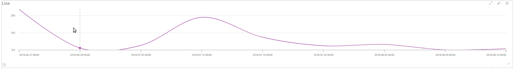

`template`

```vue
<d3-line
    :data="data"
    :options="options"
    :margin="margin"
    @range-updated="(dateTimeStart, dateTimeEnd) => fetchDataWithCurrentInterval(dateTimeStart, dateTimeEnd)"
    width="100%"
    height="300px">
</d3-line>
```

`options`

|key|description|type|default|
|:---|:---|:---|:---|
|`stroke`|`line edge color`|`string (rgb, hex, rgba, hsl...)`|`rgb(188, 82, 188)`|
|`strokeWidth`|`line edge width`|`number`|`2`|
|`axisXLaneHeight`|`lane height of the axis x`|`number`|`60`|
|`axisYLaneWidth`|`lane width of the axis y`|`number`|`35`|
|`axisFontSize`|`axis text font size`|`number`|`12`|
|`axisFontWeight`|`axis text font weight`|`number`|`400`|
|`axisFontOpacity`|`axis text font opacity`|`number`|`1`|
|`tickSize`|`tick height/width of axis`|`number`|`10`|
|`tickPadding`|`tick padding`|`number`|`8`|
|`circleRadius`|`emphasis circle radius`|`number`|`5`|
|`circleColor`|`emphasis circle color`|`number`|`rgb(188, 82, 188)`|
|`circleTitle`|`emphasis circle tooltip`|`function`|`d => d.value`|
|`curve`|`curve algorithm`|`string`|`curveCardinal`|
|`axisXLabel`|`label of axis x`|`string or null`|`null`|
|`axisYLabel`|`label of axis y`|`string or null`|`null`|
|`axisLabelFontSize`|`label font size`|`number`|`14`|
|`axisLabelFontWeight`|`label font weight`|`number`|`600`|
|`axisLabelFontOpacity`|`label font opacity`|`number`|`1`|
|`axisXInterval`|`used when data is of type date_histogram, it will be used to decide the date format of axis x`|`number OR null`|`null`|
|`isAxisPathShow`|`if the axis path will be shown`|`boolean`|`true`|
|`isAxisTickShow`|`if the axis tick will be shown`|`boolean`|`true`|
|`axisXTickFormat`|`d3-format support`|`string`|`.2s`|
|`negative`|`the axis y should start at 0 or not`|`boolean`|`false`|
|`nice`|`the tick number of axis should be rounded or not`|`boolean`|`false`|
|`yAxisRuler`|`if the ruler of the axis y should be enabled`|`boolean`|`true`|


`events`

|name|description|arguments|
|:---|:---|:---|
|`range-updated`|`new range has been chosen by using the brush|`(dateTimeStart, dateTimeEnd)`|


*###d3Area*

This components is for show big date_histogram data, It takes an array of elements like `{key : 'Date', value : 'Number'}`.

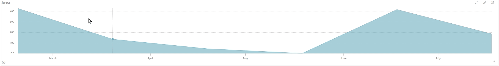

`template`

```vue
<d3-area
    :data="data"
    :options="options"
    :margin="margin"
    @range-updated="(dateTimeStart, dateTimeEnd) => fetchDataWithCurrentInterval(dateTimeStart, dateTimeEnd)"
    width="100%"
    height="300px">
</d3-area>
```

`options`

|key|description|type|default|
|:---|:---|:---|:---|
|`fill`|`area path internal color`|`string (rgb, hex, hsl...)`|`#6eadc1`|
|`fillOpacity`|`area path internal color opacity`|`number`|`0.6`|
|`stroke`|`area path edge color`|`string (rgb, hex, rgba, hsl...)`|`rgb(188, 82, 188)`|
|`strokeOpacity`|`area path edge color opacity`|`number`|`1`|
|`areaTitle`|`tooltip`|`function`|`d => d.value`|
|`axisXLaneHeight`|`lane height of the axis x`|`number`|`35`|
|`axisYLaneWidth`|`lane width of the axis y`|`number`|`60`|
|`axisFontSize`|`axis text font size`|`number`|`12`|
|`axisFontWeight`|`axis text font weight`|`number`|`400`|
|`axisFontOpacity`|`axis text font opacity`|`number`|`1`|
|`tickSize`|`tick height/width of axis`|`number`|`10`|
|`tickPadding`|`tick padding`|`number`|`8`|
|`curve`|`curve algorithm`|`string`|`curveLinear`|
|`axisXLabel`|`label of axis x`|`string or null`|`null`|
|`axisYLabel`|`label of axis y`|`string or null`|`null`|
|`axisLabelFontSize`|`label font size`|`number`|`14`|
|`axisLabelFontWeight`|`label font weight`|`number`|`600`|
|`axisLabelFontOpacity`|`label font opacity`|`number`|`1`|
|`axisXTickFormat`|`d3-format support`|`string`|`.2s`|
|`negative`|`the axis y should start at 0 or not`|`boolean`|`false`|
|`nice`|`the tick number of axis should be rounded or not`|`boolean`|`false`|
|`isAxisPathShow`|`if the axis path will be shown`|`boolean`|`true`|
|`isAxisTickShow`|`if the axis tick will be shown`|`boolean`|`true`|
|`yAxisRuler`|`if the ruler of the axis y should be enabled`|`boolean`|`true`|


*###d3MultiLine*

This component is for showing multiple lines together. It takes an array of elements like `{group: 'string', key : 'String|Date|Number', value: 'Number'}`.

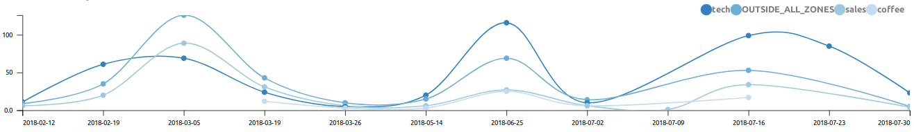

`template`

```vue
<d3-multi-line
    :data="data"
    :options="options"
    :margin="margin"
    @range-updated="(dateTimeStart, dateTimeEnd) => fetchDataWithCurrentInterval(dateTimeStart, dateTimeEnd)"
    width="100%"
    height="300px">
</d3-multi-line>
```

`options`

|key|description|type|default|
|:---|:---|:---|:---|
|`strokeWidth`|`line edge width`|`number`|`2`|
|`axisXLaneHeight`|`lane height of the axis x`|`number`|`60`|
|`axisYLaneWidth`|`lane width of the axis y`|`number`|`35`|
|`axisFontSize`|`axis text font size`|`number`|`12`|
|`axisFontWeight`|`axis text font weight`|`number`|`400`|
|`axisFontOpacity`|`axis text font opacity`|`number`|`1`|
|`tickSize`|`tick height/width of axis`|`number`|`10`|
|`tickPadding`|`tick padding`|`number`|`8`|
|`circleRadius`|`emphasis circle radius`|`number`|`5`|
|`circleTitle`|`emphasis circle tooltip`|`function`|`d => d.value`|
|`crossWidth`|`legend cross line edge width`|`number`|`2`|
|`crossColor`|`legend cross line color`|`string (rgb, hex, rgba, hsl...)`|`white`|
|`curve`|`curve algorithm`|`string`|`curveCardinal`|
|`axisXLabel`|`label of axis x`|`string or null`|`null`|
|`axisYLabel`|`label of axis y`|`string or null`|`null`|
|`axisLabelFontSize`|`label font size`|`number`|`14`|
|`axisLabelFontWeight`|`label font weight`|`number`|`600`|
|`axisLabelFontOpacity`|`label font opacity`|`number`|`1`|
|`axisXInterval`|`used when data is of type date_histogram, it will be used to decide the date format of axis x. (unit: ms)`|`number OR null`|`null`|
|`axisXTickFormat`|`d3-format support`|`string`|`.2s`|
|`negative`|`the axis y should start at 0 or not`|`boolean`|`false`|
|`nice`|`the tick number of axis should be rounded or not`|`boolean`|`false`|
|`isAxisPathShow`|`if the axis path will be shown`|`boolean`|`true`|
|`isAxisTickShow`|`if the axis tick will be shown`|`boolean`|`true`|
|`yAxisRuler`|`if the ruler of the axis y should be enabled`|`boolean`|`false`|
|`axisXGroupLabelLaneHeight`|`group lane height`|`number`|`20`|
|`axisXGroupLabelFillColorOpacity`|`group legend internal color opacity`|`number`|`1`|
|`axisXGroupLabelBorderColorOpacity`|`group legend edge color opacity`|`number`|`0.6`|
|`axisXGroupLabelGap`|`group legend gap`|`number`|`10`|


*###d3GroupedArea*

This component is for showing multiple lines together. It takes an array of elements like `{group: 'string', key : 'String|Date|Number', value: 'Number'}`.

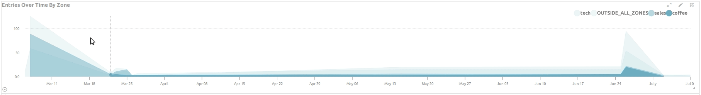

`template`

```vue
<d3-grouped-area
    :data="data"
    :options="options"
    :margin="margin"
    @range-updated="(dateTimeStart, dateTimeEnd) => fetchDataWithCurrentInterval(dateTimeStart, dateTimeEnd)"
    width="100%"
    height="300px">
</d3-grouped-area>
```

`options`

|key|description|type|default|
|:---|:---|:---|:---|
|`fill`|`area path internal color`|`string (rgb, hex, hsl...)`|`#6eadc1`|
|`axisXLaneHeight`|`lane height of the axis x`|`number`|`35`|
|`axisYLaneWidth`|`lane width of the axis y`|`number`|`60`|
|`axisFontSize`|`axis text font size`|`number`|`12`|
|`axisFontWeight`|`axis text font weight`|`number`|`400`|
|`axisFontOpacity`|`axis text font opacity`|`number`|`1`|
|`tickSize`|`tick height/width of axis`|`number`|`10`|
|`tickPadding`|`tick padding`|`number`|`8`|
|`circleRadius`|`emphasis circle radius`|`number`|`5`|
|`groupedAreaTitle`|`emphasis circle tooltip`|`function`|`d => d.value`|
|`crossWidth`|`legend cross line edge width`|`number`|`2`|
|`crossColor`|`legend cross line color`|`string (rgb, hex, rgba, hsl...)`|`white`|
|`curve`|`curve algorithm`|`string`|`curveLinear`|
|`axisXLabel`|`label of axis x`|`string or null`|`null`|
|`axisYLabel`|`label of axis y`|`string or null`|`null`|
|`axisLabelFontSize`|`label font size`|`number`|`14`|
|`axisLabelFontWeight`|`label font weight`|`number`|`600`|
|`axisLabelFontOpacity`|`label font opacity`|`number`|`1`|
|`axisXInterval`|`used when data is of type date_histogram, it will be used to decide the date format of axis x. (unit: ms)`|`number OR null`|`null`|
|`axisXTickFormat`|`d3-format support`|`string`|`.2s`|
|`negative`|`the axis y should start at 0 or not`|`boolean`|`false`|
|`nice`|`the tick number of axis should be rounded or not`|`boolean`|`false`|
|`isAxisPathShow`|`if the axis path will be shown`|`boolean`|`true`|
|`isAxisTickShow`|`if the axis tick will be shown`|`boolean`|`true`|
|`yAxisRuler`|`if the ruler of the axis y should be enabled`|`boolean`|`true`|
|`axisXGroupLabelLaneHeight`|`group lane height`|`number`|`20`|
|`axisXGroupLabelFillColorOpacity`|`group legend internal color opacity`|`number`|`1`|
|`axisXGroupLabelBorderColorOpacity`|`group legend edge color opacity`|`number`|`0.6`|
|`axisXGroupLabelGap`|`group legend gap`|`number`|`10`|


## Flow Of Transitions

*###d3SankeyCircular*

This component is for showing the flow of transitions between zones. It takes an array `nodes` to represent all the zones, and it takes an array of elements
like:


```javascript
{
    source: `String`,
    target: `String`,
    value: 'Number'
}
```

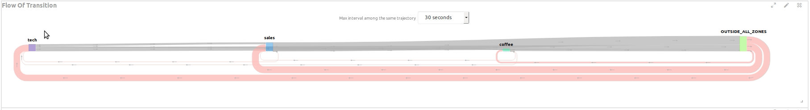


`template`

```vue
<d3-sankey-circular
    :nodes="nodes"
    :links="links"
    :options="options"
    :nodeTitle="nodeTitle"
    :linkTitle="linkTitle"
    @max-period-updated="(period) => yourMethod(period)"
    width="100%"
    height="300px">
</d3-sankey-circular>
```

`nodeTitle`

Tooltip of zone. Default to `d => ${d.name}<br>${d.value} `.

`linkTitle`

Tooltip of link. Default to `d => ${d.source.name} → ${d.target.name}<br>${d.value}`.

`options`

|key|description|type|default|
|:---|:---|:---|:---|
|`nodeWidth`|`node width`|`number`|`20`|
|`nodeTextFontSize`|`node text font size`|`number`|`12`|
|`nodeTextFontWeight`|`node text font weight`|`number`|`600`|
|`nodeTextFontOpacity`|`node text font opacity`|`number`|`1`|
|`circularLinkGap`|`circular link gap`|`number`|`4`|
|`circularLinkColor`|`circularLinkColor`|`string (rgb, hex, rgba, hsl...)`|`red`|
|`linkColor`|`link color`|`string (rgb, hex, rgba, hsl...)`|`black`|
|`gapLength`|`gap length`|`number`|`150`|
|`arrowLength`|`arrow length`|`number`|`10`|
|`arrowHeadSize`|`arrow head size`|`number`|`4`|
|`axisXSelectBoxLabel`|`select box label`|`string`|`Max interval among the same trajectory`|
|`axisXSelectBoxLabelFontSize`|`select box label font size`|`number`|`12`|
|`axisXSelectBoxLabelFontWeight`|`select box label font weight`|`number`|`400`|
|`axisXSelectBoxLabelFontOpacity`|`select box label font opacity`|`number`|`0.5`|
|`axisXLabel`|`label of axis x`|`string OR null`|`null`|
|`axisXLabelFontSize`|`label font size of axis x`|`number`|`14`|
|`axisXLabelFontWeight`|`label font weight of axis x`|`number`|`600`|
|`axisXLabelFontOpacity`|`label font opacity`|`number`|`1`|


## Time Series


*###d3Timelion*

This component is similar to `kibana timelion` with a interval select box. It accepts an array of elements like `{ key : 'Date', value: 'Number'}`.

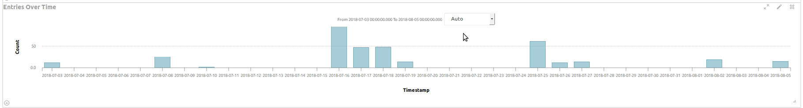

`template`

```vue
<d3-timelion
    :data="data"
    :options="options"
    :margin="margin"
    width="100%"
    height="300px"
    @range-updated="(dateTimeStart, dateTimeEnd) => fetchDataWithCurrentInterval(dateTimeStart, dateTimeEnd)"
    @interval-updated="interval => fetchDataWithInterval(interval)">
</d3-timelion>
```

`options`

|key|description|type|default|
|:---|:---|:---|:---|
|`fill`|`bar internal color`|`string (rgb, hex, hsl...)`|`#6eadc1`|
|`stroke`|`bar edge color`|`string (rgb, hex, hsl...)`|`#6eadc1`|
|`fillOpacity`|`bar internal color opacity`|`number`|`0.6`|
|`strokeOpacity`|`bar edge color opacity`|`number`|`1`|
|`barTitle`|`tooltip`|`function`|`d => d.value`|
|`tickSize`|`tick height/width of axis`|`number`|`10`|
|`tickPadding`|`tick padding`|`number`|`8`|
|`axisFontSize`|`axis text font size`|`number`|`12`|
|`axisFontWeight`|`axis text font weight`|`number`|`400`|
|`axisFontOpacity`|`axis text font opacity`|`number ([0, 1])`|`0.5`|
|`axisXLabel`|`label of axis x`|`string or null`|`null`|
|`axisYLabel`|`label of axis y`|`string or null`|`null`|
|`axisLabelFontSize`|`label font size`|`number`|`14`|
|`axisLabelFontWeight`|`label font weight`|`number`|`600`|
|`axisLabelFontOpacity`|`label font opacity`|`number`|`1`|
|`axisXLaneHeight`|`lane height of axis x`|`number`|`60`|
|`axisYLaneWidth`|`lane width of axis y`|`number`|`60`|
|`axisXInterval`|`used when data is of type date_histogram, it will be used to calculate the date format of axis x. (unit: ms)`|`number OR null`|`null`|
|`isAxisPathShow`|`if the axis path will be shown`|`boolean`|`true`|
|`isAxisTickShow`|`if the axis tick will be shown`|`boolean`|`true`|
|`animationDuration`|`duration of animation`|`number`|`1000`|
|`delay`|`delay of animation (milliseconds)`|`number`|`50`|
|`axisYTickFormat`|`d3-format support`|`string`|`.2s`|
|`negative`|`the axis y should start at 0 or not`|`boolean`|`false`|
|`nice`|`the tick number of axis should be rounded or not`|`boolean`|`false`|
|`timeRangeLabelFontSize`|`time range label font size`|`number`|`12`|
|`timeRangeLabelFontWeight`|`time range label font weight`|`number`|`400`|
|`timeRangeLabelFontOpacity`|`time range label font opacity`|`number`|`0.5`|
|`yAxisRuler`|`if the ruler of the axis y should be enabled`|`boolean`|`true`|

`events`

|event|description|arguments|
|:---|:---|:---|
|`range-updated`|`user has chosen a new time range by using the brush`|`(dateTimeStart, dateTimeEnd)`|
|`interval-updated`|`user has changed the time interval by using the select box`|`(interval)`|


*###d3Timeline*

This component is for showing time entries. We have two type entries in `d3Timeline`, they are `Point` and `Interval`. It takes an array of entries as data.

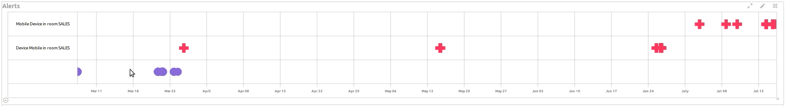

To specify an entry `Point`:

```javascript
{
   at: 'Date',
   // tooltip
   title: 'String',
   group: 'String',
   // internally we have 4 className, they are 'entry--point--default', 'entry--point--success', 'entry--point--warn', 'entry--point--info'
   // you can also specify your own class and add it to SPA. The class shouldn't be in scoped style
   className: 'String',
   // it supports 7 symbols, they are 'symbolCircle', 'symbolCross', 'symbolDiamond', 'symbolSquare', 'symbolStar', 'symbolTriangle', 'symbolWye'
   symbol: 'String'
}
```

To specify an entry 'Interval':

```javascript
{
    from : 'Date',
    to: 'Date',
    // tooltip
    title: 'String',
    label: 'String',
    group: 'String',
    // internally we have 4 className, they are 'entry--point--default', 'entry--point--success', 'entry--point--warn', 'entry--point--info'
    // you can also specify your own class and add it to SPA. The class shouldn't be in scoped style
    className: 'String'
}
```


`template`

```vue
<d3-timeline
    :data="data"
    :options="options"
    :margin="margin"
    width="100%"
    height="300px"
    @range-updated="(dateTimeStart, dateTimeEnd) => yourMethod(dateTimeStart, dateTimeEnd)">
</d3-timeline>
```

`options`

|key|description|type|default|
|:---|:---|:---|:---|
|`intervalCornerRadius`|`corner radius of Interval entry `|`number`|`4`|
|`symbolSize`|`symbol size of Point entry `|`number`|`400`|
|`groupLabelFontSize`|`group label font size`|`number`|`12`|
|`groupLabelFontWeight`|`group label font weight`|`number`|`400`|
|`groupLabelFontOpacity`|`group label font opacity`|`number`|`1`|
|`groupLaneWidth`|`group lane width`|`number`|`200`|
|`tickSize`|`tick size of axis`|`number`|`10`|
|`tickPadding`|`tick size padding`|`number`|`8`|
|`axisXLaneHeight`|`lane height of axis x`|`number`|`40`|
|`axisFontSize`|`axis text font size`|`number`|`12`|
|`axisFontWeight`|`axis text font weight`|`number`|`400`|
|`axisFontOpacity`|`axis text font opacity`|`number ([0, 1])`|`0.5`|
|`axisXLabel`|`label of axis x`|`string or null`|`null`|
|`axisLabelFontSize`|`label font size`|`number`|`14`|
|`axisLabelFontWeight`|`label font weight`|`number`|`600`|
|`axisLabelFontOpacity`|`label font opacity`|`number`|`1`|
|`backgroundColor`|`background color`|`string (rgb, hex, rgba, hsl...)`|`rgba(255, 255, 255, 0.125)`|
|`borderRadius`|`border radius`|`number`|`0`|
|`borderWidth`|`border width`|`number`|`2`|
|`borderColor`|`border color`|`string (rgb, hex, rgba, hsl...)`|`rgba(0, 0, 0, .125)`|
|`boundingLineWidth`|`bounding line width`|`number`|`2`|
|`boundingLineColor`|`bounding line color`|`string (rgb, hex, rgba, hesl...)`|`rgba(0, 0, 0, .125)`|
|`currentTimeLineWidth`|`current time line width`|`number`|`2`|
|`currentTimeLineColor`|`current time line color`|`string (rgb, hex, rgba, hsl...)`|`rgba(255, 56, 96, 1)`|
|`liveTimer`|`if live timer reference line should be enabled`|`boolean`|`true`|
|`liveTimerTick`|`live time reference line move interval`|`number (unit: ms)`|`250`|
|`scaleExtent`|`the zoom range`|`Array`|`[0.5, Infinity]`|

`events`

|event|description|arguments|
|:---|:---|:---|
|`range-updated`|`new range selected`|`(dateTimeStart, dateTimeEnd)`|


## Functional

*###d3Player*

This component is like `d3Timeline`. The difference is that `d3Player` has no support for group and is designed to simulate trajectories and to replay trajectories,
. It will also trigger an event to tell us the dateTime of the cursor and the entries it is now passing.

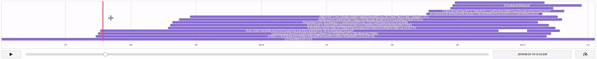

`template`

```vue
<d3-player
    :data="data"
    :options="options"
    :margin="margin"
    width="100%"
    height="300px"
    @range-updated="(dateTimeStart, dateTimeEnd) => yourMethod(dateTimeStart, dateTimeEnd)"
    @reference-updated="(dateTimeRange, entries) => yourMethod(dateTimeRange, entries)">
</d3-player>
```

`options`

|key|description|type|default|
|:---|:---|:---|:---|
|`intervalCornerRadius`|`corner radius of Interval entry `|`number`|`4`|
|`symbolSize`|`symbol size of Point entry `|`number`|`400`|
|`tickSize`|`tick size of axis`|`number`|`10`|
|`tickPadding`|`tick size padding`|`number`|`8`|
|`axisXLaneHeight`|`lane height of axis x`|`number`|`40`|
|`axisFontSize`|`axis text font size`|`number`|`12`|
|`axisFontWeight`|`axis text font weight`|`number`|`400`|
|`axisFontOpacity`|`axis text font opacity`|`number ([0, 1])`|`0.5`|
|`backgroundColor`|`background color`|`string (rgb, hex, rgba, hsl...)`|`rgba(255, 255, 255, 0.125)`|
|`borderRadius`|`border radius`|`number`|`0`|
|`borderWidth`|`border width`|`number`|`2`|
|`borderColor`|`border color`|`string (rgb, hex, rgba, hsl...)`|`rgba(0, 0, 0, .125)`|
|`boundingLineWidth`|`bounding line width`|`number`|`2`|
|`boundingLineColor`|`bounding line color`|`string (rgb, hex, rgba, hesl...)`|`rgba(0, 0, 0, .125)`|
|`referenceLineWidth`|`reference time line width`|`number`|`4`|
|`referenceLineColor`|`reference time line color`|`string (rgb, hex, rgba, hsl...)`|`rgba(255, 56, 96, 1)`|
|`overlayWidth`|`cursor overlay rectangle width`|`number`|`30`|

`events`

|event|description|arguments|
|:---|:---|:---|
|`reference-updated`|`reference cursor move`|`(dateTimeRange, entries)`|
|`range-updated`|`new range selected`|`(dateTimeStart, dateTimeEnd)`|


*###d3HorizontalSlider*

This component is make it more simple to choose a value in a range. This range can be a range of color, date or number. It takes a `min` and `max`
as data.

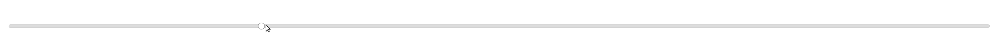

`template`

```vue
<d3-horizontal-slider
    :min="min"
    :max="max"
    :margin="margin"
    :options="options"
    @input="(val) => yourMethod(val)"
    width="100%"
    height="100%">
</d3-horizontal-slider>
```

`options`

|key|description|type|default|
|:---|:---|:---|:---|
|`trackStroke`|`track edge color`|`string (rgb, hex, rgba, hsl...)`|`#000`|
|`trackStrokeWidth`|`track edge width`|`number`|`10`|
|`trackStrokeOpacity`|`track edge opacity`|`number`|`0.3`|
|`trackRounded`|`track round or not`|`boolean`|`true`|
|`trackInsetStroke`|`inset track edge color`|`string (rgb, hex, rgba, hsl...)`|`#ddd`|
|`trackInsetStrokeOpacity`|`inset track edge color opacity`|`number`|`1`|
|`trackInsetStrokeWidth`|`inset track edge width`|`number`|`8`|
|`circleFill`|`circle handler internal color`|`string (rgb, hex, rgba, hsl...)`|`#fff`|
|`circleStroke`|`circle handler edge color`|`string (rgb, hex, rgba, hsl...)`|`#000`|
|`circleStrokeOpacity`|`circle handler edge color opacity`|`number`|`0.5`|
|`circleStrokeWidth`|`circle handler edge width`|`number`|`1.25`|


*###d3VerticalSlider*

This component is make it more simple to choose a value in a range. This range can be a range of color, date or number. It takes a `min` and `max`
as data.


`template`

```vue
<d3-vertical-slider
    :min="min"
    :max="max"
    :margin="margin"
    :options="options"
    @input="(val) => yourMethod(val)"
    width="100%"
    height="100%">
</d3-vertical-slider>
```

`options`

|key|description|type|default|
|:---|:---|:---|:---|
|`trackStroke`|`track edge color`|`string (rgb, hex, rgba, hsl...)`|`#000`|
|`trackStrokeWidth`|`track edge width`|`number`|`10`|
|`trackStrokeOpacity`|`track edge opacity`|`number`|`0.3`|
|`trackRounded`|`track round or not`|`boolean`|`true`|
|`trackInsetStroke`|`inset track edge color`|`string (rgb, hex, rgba, hsl...)`|`#ddd`|
|`trackInsetStrokeOpacity`|`inset track edge color opacity`|`number`|`1`|
|`trackInsetStrokeWidth`|`inset track edge width`|`number`|`8`|
|`circleFill`|`circle handler internal color`|`string (rgb, hex, rgba, hsl...)`|`#fff`|
|`circleStroke`|`circle handler edge color`|`string (rgb, hex, rgba, hsl...)`|`#000`|
|`circleStrokeOpacity`|`circle handler edge color opacity`|`number`|`0.5`|
|`circleStrokeWidth`|`circle handler edge width`|`number`|`1.25`|


## Layout

*###d3Tree*

This component is for showing `tree` layout which is recursive. It takes an object of `Hierarchical layouts` as data.

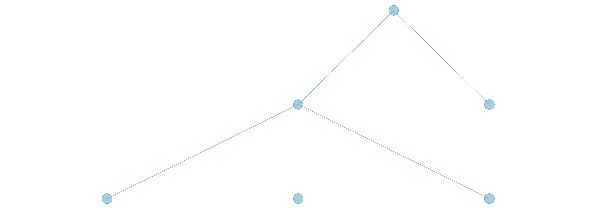

`hierarchical layout object`

```javascript
{
  "name": "A1",
  "children": [
    {
      "name": "B1",
      "children": [
        {
          "name": "C1",
          "value": 100
        },
        {
          "name": "C2",
          "value": 300
        },
        {
          "name": "C3",
          "value": 200
        }
      ]
    },
    {
      "name": "B2",
      "value": 200
    }
  ]
}
```

`template`

```vue
<d3-tree
    :data="data"
    :options="options"
    :margin="margin"
    width="100%"
    height="300px">
</d3-tree>
```

`options`

|key|description|type|default|
|:---|:---|:---|:---|
|`nodeTitle`|`tooltip`|`function`|`d => d.data.key + '<br>' + 'd.data.value'`|
|`nodeFill`|`tree node internal color`|`string (rgb, hex, rgba, hsl...)`|`#6eadc1`|
|`nodeStroke`|`tree node edge color`|`string (rgb, hex, rgba, hsl...)`|`#6eadc1`|
|`nodeFillOpacity`|`tree node internal color opacity`|`number`|`0.6`|
|`nodeStrokeOpacity`|`tree node edge color opacity`|`number`|`1`|
|`linkStroke`|`link edge color`|`string (rgb, hex, rgba, hsl...)`|`#6eadc1`|
|`linkStrokeWidth`|`link edge width`|`number`|`1`|
|`linkStrokeOpacity`|`link edge color opacity`|`number`|`1`|
|`nodeRadius`|`tree node circle radius`|`number`|`10`|
|`axisXLabel`|`label of axis x`|`string or null`|`null`|
|`axisFontSize`|`axis text font size`|`number`|`12`|
|`axisFontWeight`|`axis text font weight`|`number`|`400`|
|`axisFontOpacity`|`axis text font opacity`|`number ([0, 1])`|`0.5`|


*###d3Cluster*

This component is like `d3-tree` but with all leaf nodes are at the same height. It takes an object of `Hierarchical layouts` as data.

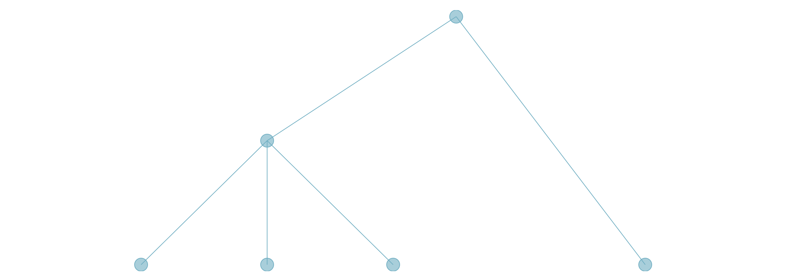

`hierarchical layout object`

```javascript
{
  "name": "A1",
  "children": [
    {
      "name": "B1",
      "children": [
        {
          "name": "C1",
          "value": 100
        },
        {
          "name": "C2",
          "value": 300
        },
        {
          "name": "C3",
          "value": 200
        }
      ]
    },
    {
      "name": "B2",
      "value": 200
    }
  ]
}
```

`template`

```vue
<d3-cluster
    :data="data"
    :options="options"
    :margin="margin"
    width="100%"
    height="300px">
</d3-cluster>
```

`options`

|key|description|type|default|
|:---|:---|:---|:---|
|`nodeTitle`|`tooltip`|`function`|`d => d.data.key + '<br>' + 'd.data.value'`|
|`nodeFill`|`tree node internal color`|`string (rgb, hex, rgba, hsl...)`|`#6eadc1`|
|`nodeStroke`|`tree node edge color`|`string (rgb, hex, rgba, hsl...)`|`#6eadc1`|
|`nodeFillOpacity`|`tree node internal color opacity`|`number`|`0.6`|
|`nodeStrokeOpacity`|`tree node edge color opacity`|`number`|`1`|
|`linkStroke`|`link edge color`|`string (rgb, hex, rgba, hsl...)`|`#6eadc1`|
|`linkStrokeWidth`|`link edge width`|`number`|`1`|
|`linkStrokeOpacity`|`link edge color opacity`|`number`|`1`|
|`nodeRadius`|`tree node circle radius`|`number`|`10`|
|`axisXLabel`|`label of axis x`|`string or null`|`null`|
|`axisFontSize`|`axis text font size`|`number`|`12`|
|`axisFontWeight`|`axis text font weight`|`number`|`400`|
|`axisFontOpacity`|`axis text font opacity`|`number ([0, 1])`|`0.5`|


*###d3ICicleHorizontal*

This component is for show `icicle horizontal` layout which is recursive. It takes an object of `Hierarchical layouts` as data.

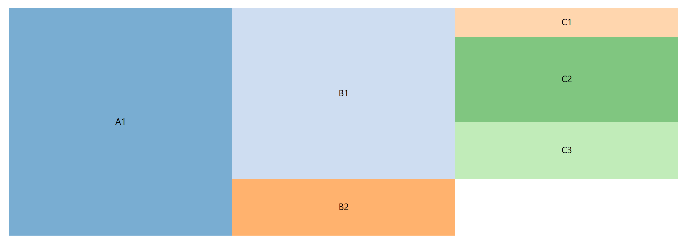

`template`

```vue
<d3-icicle-horizontal
    :data="data"
    :options="options"
    :margin="margin"
    width="100%"
    height="300px">
</d3-icicle-horizontal>
```

`options`

|key|description|type|default|
|:---|:---|:---|:---|
|`rectTitle`|`tooltip`|`function`|`d => d.data.value`|
|`padding`|`partition padding`|`number`|`0`|
|`fillOpacity`|`partition internal color opacity`|`number`|`0.6`|
|`strokeOpacity`|`partition edge color opacity`|`number`|`1`|
|`axisXLabel`|`label of axis x`|`string or null`|`null`|
|`axisFontSize`|`axis text font size`|`number`|`12`|
|`axisFontWeight`|`axis text font weight`|`number`|`400`|
|`axisFontOpacity`|`axis text font opacity`|`number ([0, 1])`|`0.5`|


*###d3ICicleVertical*

This component is for show `icicle vertical` layout which is recursive. It takes an object of `Hierarchical layouts` as data.


`template`

```vue
<d3-icicle-vertical
    :data="data"
    :options="options"
    :margin="margin"
    width="100%"
    height="300px">
</d3-icicle-vertical>
```

`options`

|key|description|type|default|
|:---|:---|:---|:---|
|`rectTitle`|`tooltip`|`function`|`d => d.data.value`|
|`padding`|`partition padding`|`number`|`0`|
|`fillOpacity`|`partition internal color opacity`|`number`|`0.6`|
|`strokeOpacity`|`partition edge color opacity`|`number`|`1`|
|`axisXLabel`|`label of axis x`|`string or null`|`null`|
|`axisFontSize`|`axis text font size`|`number`|`12`|
|`axisFontWeight`|`axis text font weight`|`number`|`400`|
|`axisFontOpacity`|`axis text font opacity`|`number ([0, 1])`|`0.5`|


*###d3Sunburst*

This component is for showing `sunburst` layout. It takes an object of `Hierarchical layouts` as data.


`hierarchical layout object`

```javascript
{
  "name": "A1",
  "children": [
    {
      "name": "B1",
      "children": [
        {
          "name": "C1",
          "value": 100
        },
        {
          "name": "C2",
          "value": 300
        },
        {
          "name": "C3",
          "value": 200
        }
      ]
    },
    {
      "name": "B2",
      "value": 200
    }
  ]
}
```

`template`

```vue
<d3-sunburst
    :data="data"
    :options="options"
    :margin="margin"
    width="100%"
    height="300px">
</d3-sunburst>
```

`options`

|key|description|type|default|
|:---|:---|:---|:---|
|`arcTitle`|`tooltip`|`function`|`d => d.data.value`|
|`padding`|`partition padding`|`number`|`0`|
|`fillOpacity`|`partition internal color opacity`|`number`|`0.6`|
|`strokeOpacity`|`partition edge color opacity`|`number`|`1`|
|`axisXLabel`|`label of axis x`|`string or null`|`null`|
|`axisFontSize`|`axis text font size`|`number`|`12`|
|`axisFontWeight`|`axis text font weight`|`number`|`400`|
|`axisFontOpacity`|`axis text font opacity`|`number ([0, 1])`|`0.5`|

*###d3Pack*

This component is for showing `pack` layout. It takes an object of `Hierarchical layouts` as data.

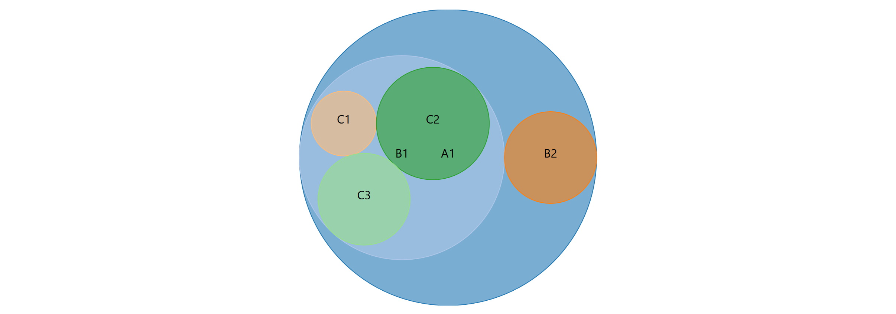

`hierarchical layout object`

```javascript
{
  "name": "A1",
  "children": [
    {
      "name": "B1",
      "children": [
        {
          "name": "C1",
          "value": 100
        },
        {
          "name": "C2",
          "value": 300
        },
        {
          "name": "C3",
          "value": 200
        }
      ]
    },
    {
      "name": "B2",
      "value": 200
    }
  ]
}
```

`template`

```vue
<d3-pack
    :data="data"
    :options="options"
    :margin="margin"
    width="100%"
    height="300px">
</d3-pack>
```

`options`

|key|description|type|default|
|:---|:---|:---|:---|
|`circleTitle`|`tooltip`|`function`|`d => d.data.key + '<br>' + d.data.value`|
|`circleFillOpacity`|`partition circle internal color opacity`|`number`|`0.6`|
|`circleStrokeOpacity`|`partition circle edge color opacity`|`number`|`1`|
|`axisXLabel`|`label of axis x`|`string or null`|`null`|
|`axisFontSize`|`axis text font size`|`number`|`12`|
|`axisFontWeight`|`axis text font weight`|`number`|`400`|
|`axisFontOpacity`|`axis text font opacity`|`number ([0, 1])`|`0.5`|


## ToDo

- `d3ColorPicker`
- `d3Gantt`
- `d3Gauge`
- `d3Goal`
- `d3HeatMap`
- `d3RadialBar`
- `d3RadialSector`
- `d3RadialLine`
- `d3ScatterPlot`
- `d3Table`
- `d3WordCloud`
- `d3Markdown`
- `d3JsonViewer`
- `d3LReplay`


## License
MIT
